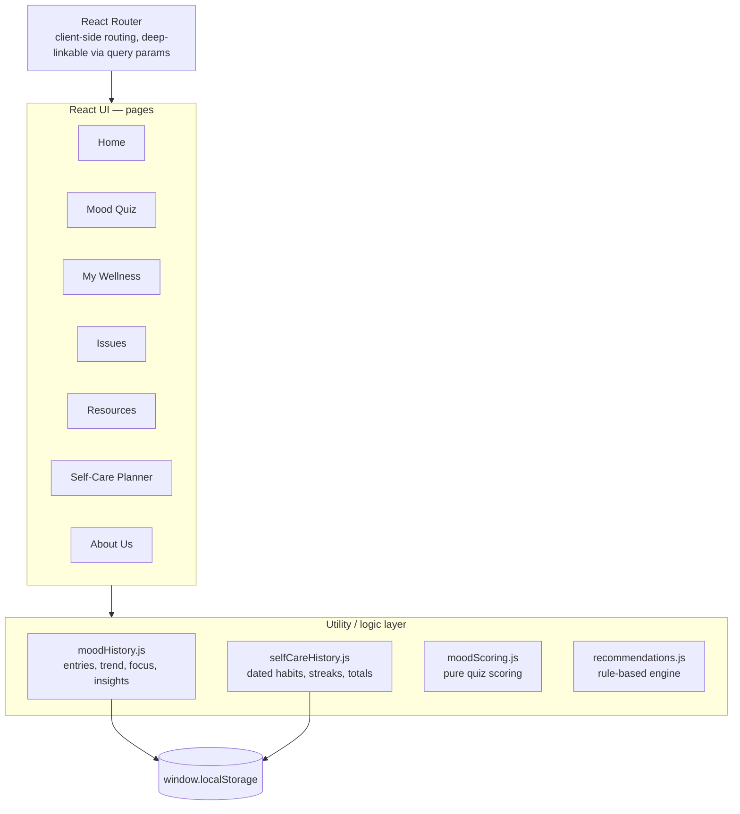
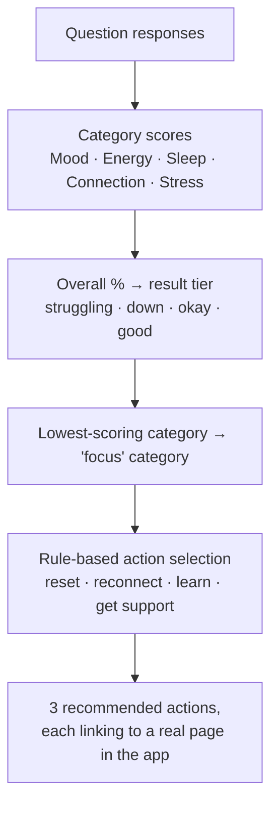

# 🌿 Thrive Mind

[](https://github.com/CS571-S26/Thrive-Mind/actions/workflows/ci.yml)

Thrive Mind is a client-side mental wellness platform built for college students. It combines a non-diagnostic mood check-in, an explainable rule-based recommendation engine, mood history and trend tracking, self-care habit tracking, and curated (and verified) campus support resources in a single accessible interface.

[**Live site**](https://cs571-s26.github.io/Thrive-Mind/) · [Run it locally](#️-run-it-locally) · [Architecture](#-architecture)

## ✨ Features

- **Home** — a needs-based landing page ("I'm feeling overwhelmed", "I feel lonely", etc.) that routes straight to the relevant help
- **Mood Quiz** — a short check-in (explicitly **not** a diagnostic tool) that scores five categories — Mood, Energy, Sleep, Connection, Stress — and surfaces the one worth focusing on today
- **My Wellness** — a personal dashboard pulling together your mood trend, self-care streak, and the same rule-based recommendations from your last check-in
- **Mental Health Issues** — plain-language explanations of stress, academic pressure, anxiety, burnout, procrastination, loneliness, homesickness, and more, with sourced links to UW–Madison UHS, NIMH, SAMHSA, CDC, and NAMI
- **Resources** — a verified UW–Madison support table (crisis line, counseling, Let's Talk, and more) plus crisis hotlines, therapist finders, apps, and educational links
- **Self-Care Planner** — track small daily wellness habits, with a streak and monthly total
- **About Us** — who built Thrive Mind, why, and how to reach us

## 🧭 Architecture

This is a static, client-only React app — there's no backend or database. All state lives in the browser and persists via `localStorage`.



Each page component reads/writes through the utility layer rather than touching `localStorage` directly. `moodScoring.js` and `recommendations.js` are pure — no storage dependency at all — which is what makes the recommendation engine below reusable in two different UI contexts (Mood Quiz results and the Dashboard) without duplicating logic.

## 🧠 Explainable, rule-based recommendation engine

The Mood Quiz and Dashboard don't use AI. Recommendations come from a small, fully explainable lookup — every suggestion can be traced back to a specific rule:



For example: a check-in scoring Stress 25%, Sleep 50%, Connection 75% sets **Stress** as the focus category, which maps to a stress-management reading suggestion; a Connection score above 60% skips the "reach out to someone" nudge (no point suggesting it to someone already well-connected); and a "down" result tier adds a campus-counselor suggestion as the closing action. The code comments on this intentionally: `recommendations.js` describes itself as "a small, fully rule-based recommendation engine — no AI, just an explainable lookup," and `moodHistory.js`'s pattern-detection helper is documented as "a simple, explainable, rule-based nudge — not a diagnosis, just a pattern flag."

## 🔗 Access the live site

Thrive Mind is deployed with GitHub Pages: **https://cs571-s26.github.io/Thrive-Mind/**

No installation needed — just open the link in a browser.

## 🛠️ Run it locally

```bash
git clone git@github.com:CS571-S26/Thrive-Mind.git
cd Thrive-Mind
npm install
npm run dev
```

This starts a local dev server (Vite) with hot reload, printed in your terminal — typically `http://localhost:5173`.

## ✅ Testing

```bash
npm test
```

Runs the [Vitest](https://vitest.dev/) suite covering the app's core logic (mood scoring and category breakdown, the recommendation engine's rule selection, trend and streak calculation, dashboard empty-state handling) plus an automated accessibility check on every page using [axe-core](https://github.com/dequelabs/axe-core) — the same rules engine used by most browser accessibility devtools.

## 📦 Build & deploy

```bash
npm run build
```

Builds a production bundle into the `docs/` folder for local inspection.

Deployment itself is automated with GitHub Actions (`.github/workflows/deploy.yml`): every push to `main` runs lint → test → build, then publishes the result straight to GitHub Pages — no manual build-and-commit step required. A separate `ci.yml` workflow runs the same lint/test/build checks on every branch and pull request, so problems surface before they ever reach `main`.

## 🧰 Tech stack

- [React](https://react.dev/) + [React Router](https://reactrouter.com/) for the UI and page navigation
- [React Bootstrap](https://react-bootstrap.github.io/) for components and layout
- [Vite](https://vite.dev/) for local dev and production builds
- [Vitest](https://vitest.dev/) + [React Testing Library](https://testing-library.com/react) + [axe-core](https://github.com/dequelabs/axe-core) for testing
- `localStorage` as the persistence layer — no backend, no database

## ♿ Accessibility

Thrive Mind has gone through an actual manual audit, not just accessibility-minded design — here's specifically what was checked and fixed:

- **Color contrast** — every palette pair was computed against WCAG AA (4.5:1 text, 3:1 UI components), not eyeballed. This caught and fixed a real bug: white-on-gradient button and nav text that failed contrast (as low as 1.72:1) against the darker end of the indigo gradient introduced during the visual redesign, and a mobile menu icon that failed the same way. Both are now verified passing at their actual rendered positions.
- **Heading structure** — audited every page's heading tree for skipped levels. Fixed two real violations: About Us jumped from `h2` straight to `h5` (skipping `h3`/`h4` entirely), and the Issues page had 11 card headings sitting as `h2` siblings instead of nested under their `h2` list label as `h3`.
- **Accessible names** — checked every interactive element's computed accessible name, not just its visible text. Several card-style links and buttons (Home's routing cards, Issues cards, Mood Quiz recommendation cards, Dashboard action rows, the UW resource table) had no name reliably associated with them; all now carry explicit, concise `aria-label`s.
- **Keyboard navigation** — tabbed through every page confirming a logical focus order and a visible focus ring (all interactive elements use real `<button>`/`<a>`/`<input>` elements, so keyboard activation is native, not JS-simulated).
- **Reduced motion** — verified the entrance/bar-growth animations are structured so `prefers-reduced-motion: reduce` disables the animation *and* leaves elements visible (not accidentally stuck at `opacity: 0`).
- **Automated regression coverage** — every page now runs through [axe-core](https://github.com/dequelabs/axe-core) in the test suite (`npm test`), so future changes can't silently reintroduce these issues. This is genuinely how the audit caught its most interesting bug: React Bootstrap's `<ProgressBar>` puts a custom `aria-label` prop on the wrong DOM node in its default usage — the label lands on the outer, role-less wrapper `<div>` instead of the inner `role="progressbar"` element, leaving the actual progress bar with no accessible name at all. Fixed by using React Bootstrap's nested composite `<ProgressBar>` API instead, which forwards custom props to the right element.

Not yet done: a pass with an actual screen reader (VoiceOver/NVDA). axe-core catches a large, well-defined class of issues (missing labels, ARIA misuse, contrast, heading structure) but isn't a substitute for hearing how a page actually reads.

## 🗺️ Possible next steps

- **A screen reader pass** — testing with VoiceOver or NVDA directly, beyond computed accessible-name inspection
- **A backend, if there's a real reason for one** — user accounts and cloud-synced history would make the data model meaningfully better, but a wellness app collecting real personal mental-health data carries real privacy and security responsibility. Not worth adding just to look more sophisticated — an anonymous/demo-account model would be the honest way to do it if this grows further.

## 💬 Contact

Built by Ishita and Charith, students at UW-Madison. Questions, feedback, or ideas? Reach out via the **About Us** page in the app, or email:

- ishafyiw@gmail.com
- charithpareddy@gmail.com
