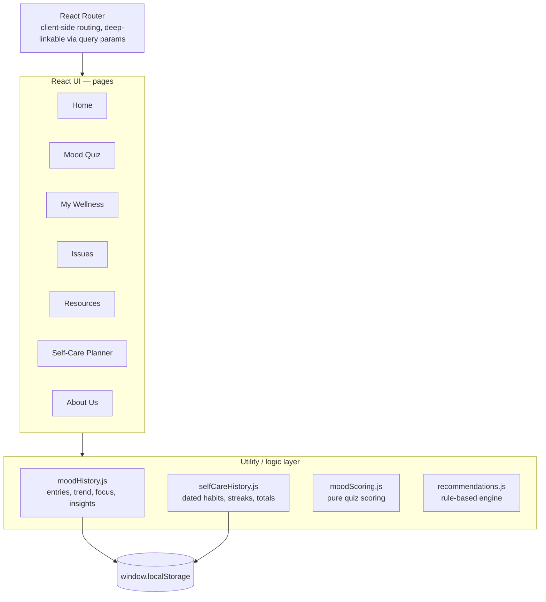
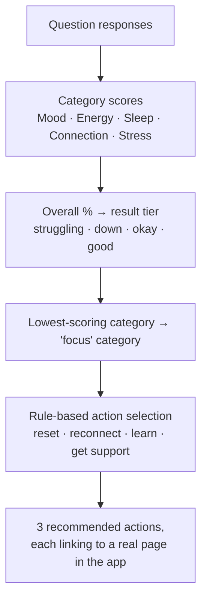

# Thrive Mind

[](https://github.com/CS571-S26/Thrive-Mind/actions/workflows/ci.yml)

[**Live site**](https://cs571-s26.github.io/Thrive-Mind/) · [GitHub](https://github.com/CS571-S26/Thrive-Mind) · [Run it locally](#development) · [Architecture](#architecture)

## What is Thrive Mind?

Thrive Mind is a client-side mental wellness platform built for college students. It combines a non-diagnostic mood check-in, an explainable rule-based recommendation engine, mood history and trend tracking, self-care habit tracking, and curated (and verified) campus support resources in a single accessible interface.

## Why it's different

Two things this project treats as first-class, not afterthoughts:

- **Explainable, not black-box** — every recommendation traces back to a specific, published rule (see [below](#recommendation-engine)), not a model. You can always answer "why did it suggest this?"
- **Accessibility-first** — contrast, heading structure, accessible names, keyboard navigation, and reduced motion were manually audited and are now covered by automated regression tests (see [Accessibility](#accessibility)).

## Features

- **Home** — a needs-based landing page ("I'm feeling overwhelmed", "I feel lonely", etc.) that routes straight to the relevant help
- **Mood Quiz** — a short check-in (explicitly **not** a diagnostic tool) that scores five categories — Mood, Energy, Sleep, Connection, Stress — and surfaces the one worth focusing on today
- **My Wellness** — a personal dashboard pulling together your mood trend, self-care streak, and the same rule-based recommendations from your last check-in
- **Mental Health Issues** — plain-language explanations of stress, academic pressure, anxiety, burnout, procrastination, loneliness, homesickness, and more, with sourced links to UW–Madison UHS, NIMH, SAMHSA, CDC, and NAMI
- **Resources** — a verified UW–Madison support table (crisis line, counseling, Let's Talk, and more) plus crisis hotlines, therapist finders, apps, and educational links
- **Self-Care Planner** — track small daily wellness habits, with a streak and monthly total
- **Privacy & Safety** — a dedicated page covering what's stored, where, and how to delete it
- **About Us** — who built Thrive Mind, why, and how to reach us

## Architecture

This is a static, client-only React app — there's no backend or database. All state lives in the browser and persists via `localStorage`.



Each page component reads/writes through the utility layer rather than touching `localStorage` directly. `moodScoring.js` and `recommendations.js` are pure — no storage dependency at all — which is what makes the recommendation engine below reusable in two different UI contexts (Mood Quiz results and the Dashboard) without duplicating logic.

## Recommendation engine

The Mood Quiz and Dashboard don't use AI. Recommendations come from a small, fully explainable lookup — every suggestion can be traced back to a specific rule:



For example: a check-in scoring Stress 25%, Sleep 50%, Connection 75% sets **Stress** as the focus category, which maps to a stress-management reading suggestion; a Connection score above 60% skips the "reach out to someone" nudge (no point suggesting it to someone already well-connected); and a "down" result tier adds a campus-counselor suggestion as the closing action.

## Design rationale & limitations

Being direct about what this system is and isn't:

- **The 35 / 55 / 75 tier thresholds are hand-designed, not empirically derived.** They split the 0–100% range into four roughly even, intuitively-labeled bands (struggling / down / okay / good). No study has been run to validate that these specific cut points reflect meaningful differences in student wellbeing.
- **The recommendation logic is deterministic, not personalized.** It picks the single lowest-scoring category and applies a fixed rule set (see diagram above) — the same inputs always produce the same outputs. That makes it fully explainable, but it doesn't adapt to an individual's history, trends, or preferences the way a more sophisticated system could.
- **No formal usability or effectiveness evaluation has been conducted.** There's no recruited-participant study, no System Usability Scale data, and no comparison against alternative recommendation strategies behind this project. Treat it as a well-intentioned, explainable prototype — not a validated clinical or behavioral tool.

Being upfront about these boundaries is intentional: an explainable rule-based system is only trustworthy if it's honest about being a heuristic, not a measured result.

## Technical highlights

- **Testing**: [Vitest](https://vitest.dev/) + [React Testing Library](https://testing-library.com/react) covering core logic (mood scoring, category breakdown, recommendation rule selection, trend/streak calculation) and component behavior, plus an automated accessibility check on every page using [axe-core](https://github.com/dequelabs/axe-core). [Playwright](https://playwright.dev/) covers real browser flows — quiz completion, keyboard-only interaction, in-progress persistence, and deep links — on both desktop and mobile viewports.
- **Persistence**: `localStorage`/`sessionStorage` by default — nothing leaves the browser unless you create an account. Signing in syncs mood check-ins and self-care history to a small Express + Prisma + Postgres API (see [server/](server/)) instead, scoped per-user behind real auth (sessions, bcrypt), so the same data follows you across devices.
- **CI/CD**: every push to `main` runs lint → test → build via GitHub Actions (`.github/workflows/deploy.yml`), then deploys straight to GitHub Pages. A separate `ci.yml` runs the same checks on every branch and pull request.

## Accessibility

Thrive Mind has gone through a manual audit, not just accessibility-minded design:

- **Color contrast** — every palette pair verified against WCAG AA (4.5:1 text, 3:1 UI components).
- **Heading structure** — every page's heading tree checked for skipped levels.
- **Accessible names** — every interactive element's computed accessible name checked, not just its visible text.
- **Keyboard navigation** — every page tabbed through for a logical focus order and visible focus ring.
- **Reduced motion** — entrance/bar-growth animations respect `prefers-reduced-motion: reduce` without leaving elements invisible.
- **Automated regression coverage** — every page runs through [axe-core](https://github.com/dequelabs/axe-core) in the test suite, so these can't silently regress.

A page-by-page manual VoiceOver testing checklist is in [ACCESSIBILITY_TESTING.md](ACCESSIBILITY_TESTING.md).

## Privacy & Safety

By default, Thrive Mind stores mood and self-care history only in your browser — nothing is sent to a server. Creating an account is optional and only changes where that same data is stored (a real, authenticated API — not a third party), so it can sync across your devices; there's still no analytics or tracking either way. Full details, plus a way to delete your data, are on the in-app [Privacy & Safety](https://cs571-s26.github.io/Thrive-Mind/#/privacy) page.

## Development

```bash
git clone git@github.com:CS571-S26/Thrive-Mind.git
cd Thrive-Mind
npm install
npm run dev
```

This starts a local dev server (Vite) with hot reload, printed in your terminal — typically `http://localhost:5173`.

**Testing:**

```bash
npm test
```

**Browser tests** ([Playwright](https://playwright.dev/), desktop + mobile viewport — quiz completion, keyboard-only interaction, persistence, deep links):

```bash
npx playwright install chromium   # first time only
npm run test:e2e
```

**Build:**

```bash
npm run build
```

Builds a production bundle into the `docs/` folder for local inspection. Deployment itself is automated (see [Technical highlights](#technical-highlights)) — no manual build-and-commit step required.

**Tech stack**: [React](https://react.dev/) + [React Router](https://reactrouter.com/), [React Bootstrap](https://react-bootstrap.github.io/), [Vite](https://vite.dev/), [Vitest](https://vitest.dev/) + [React Testing Library](https://testing-library.com/react) + [axe-core](https://github.com/dequelabs/axe-core), and `localStorage` as the only persistence layer.

## Contact

Built by Ishita and Charith, students at UW-Madison. Questions, feedback, or ideas? Reach out via the **About Us** page in the app, or email:

- ishafyiw@gmail.com
- charithpareddy@gmail.com
